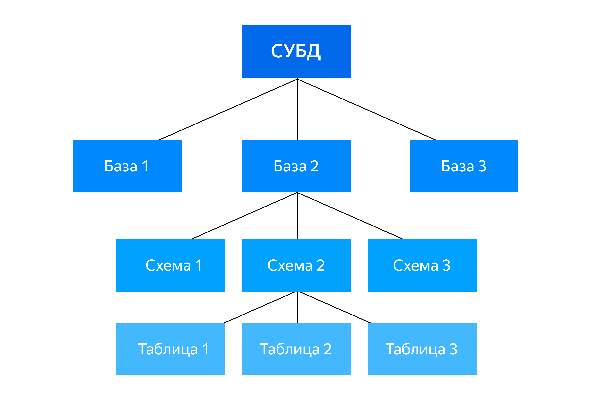

# Lab-1_DB_and_legacy
--------------------------------------------
## Дедлайны
**Мягкий** дедлайн - 2 недели  
**Жёсткий** дедлайн - 3 недели

## [Задание](Task.md)

В данной лабораторной работе вам предстоит освежить свои знания о работе с Базами данных и немного поколдовать 
над нормализацией БД.
--------------------------------------------
##  Полезная информация
### Что понадобиться для работы

1) Мы будем работать с Базой данных [**PostgreSQL**](https://www.postgresql.org/download/), установите себе на компьютер СУБД
   1) Если вы знаете, что такое Docker лучше используйте его, это облегчит вашу жизнь.

В процессе установки вам будет предложено выбрать устанавливаемые компоненты, выбирайте все доступные, в том числе **pgAdmin** и **StackBuilder**. 
Для всех предлагаемых путей установки можно выбирать варианты по умолчанию. 
В процессе установки по умолчанию создаётся суперпользователь **postgres** — самый главный пользователь без ограничений прав. Запомните пароль, который придумаете для суперпользователя, — он понадобится вам в дальнейшем.
Порт, через который вы будете подключаться к серверу, рекомендуем оставить по умолчанию — **5432**.

Ещё одним пакетом который вам пригодится - [**Dbeaver**](https://dbeaver.io/download/) однако если вы используете, другой менеджер для работы
с **БД** (Pycharm Professional, Datagrip и т.д. можете использовать его)

### Небольшая напоминалка о структуре хранения данных в СУБД


### Подготовка к работе (легенда)
Иногда данные попадают к разработчику в формате **csv** или **txt**, 
и их нужно импортировать в базу. 

Если у вас есть клиент с хорошим пользовательским интерфейсом, то, скорее всего, там будет функция импорта данных. Например, в pgAdmin для импортирования данных нужно выбрать необходимую таблицу, нажать на неё правой кнопкой и выбрать Import/Export Data.
Но такой способ не всегда удобен. 

Например, он не подойдёт, когда:
СУБД находится не на локальном компьютере и нет доступа к **GUI**.

Нужно загрузить множество файлов — придётся загружать их по одному.
Для решения подобных ситуаций в **PostgreSQL** существует команда **COPY**

```postgresql
COPY имя_таблицы [ (имя_столбца_1, имя_столбца_2, ...) ]
FROM 'имя_файла'
[ [ WITH ] (параметр_1, параметр_2, ...) ]
```

В квадратных скобках указаны необязательные части запроса.
`FORMAT` - Указывает формат файла   
`DELIMITER` - Устанавливает символ-разделитель. Применим только для форматов **text** и **csv**.   
`HEADER` - Указывает, что первая строка файла содержит имена столбцов.  
`NULL` - Определяет строковое представление значений `NULL` в файле  

Пример `csv` файла:
```csv
id,name,description
1,Marat,Chushpan
2,Andrey,N/A 
```
Импорт данных из такого файла:
```postgresql
COPY employees FROM '/path/to/file.csv' WITH CSV HEADER NULL 'N/A';
```


### Extra info (если интересно)
**Метакоманда** `\copy` 
Чтобы работать с командой `COPY`, файл, откуда импортируются данные, должен находиться на том же 
компьютере или сервере, где установлена СУБД. 
Это не всегда возможно — иногда просто неудобно копировать файлы между локальным и удалённым компьютером. 
Поэтому в **PostgreSQL** есть альтернатива команде `COPY` — метакоманда `\copy` в терминале psql.

В отличие от SQL-запроса `COPY`, метакоманда psql `\copy` взаимодействует с файлами на компьютере, 
с которого вы подключаетесь к БД, то есть вашем локальном компьютере. 

В остальном команды похожи, в том числе в синтаксисе. 
Отличие в первом слове и ещё нескольких мелочах, с которыми пользователи сталкиваются нечасто.
