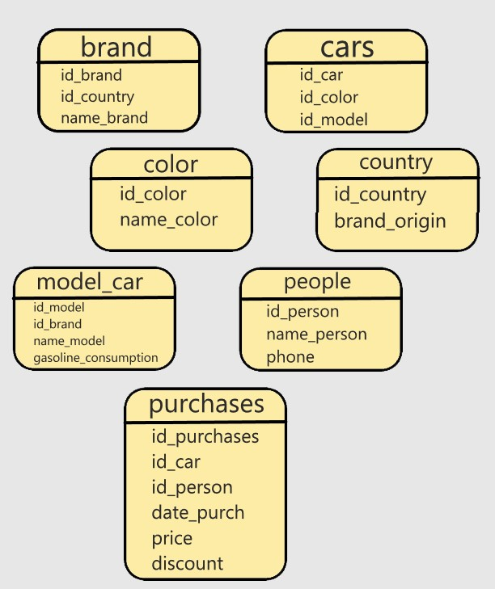

## ДОКУМЕНТАЦИЯ

### Создание схемы и таблицы для сырых данных:
Создается схема raw_data.
Создается таблица sales для хранения сырых данных о продажах автомобилей.
Поля таблицы sales включают в себя идентификатор продажи (id), марку автомобиля (auto), расход бензина (gasoline_consumption), цену (price), дату продажи (date), имя покупателя (person_name), номер телефона покупателя (phone), скидку (discount), и страну производителя бренда автомобиля (brand_origin).

### Заполнение таблицы сырых данных:
Данные загружаются из CSV-файла в таблицу raw_data.sales.

### Создание схемы и нормализованных таблиц:
Создается схема car_shop.
Создаются таблицы для нормализованной БД, такие как country, color, people, brand, model_car, cars, и purchases.

### Наполнение таблиц для нормализованной БД:
В таблицы country, color, и people вставляются уникальные значения из сырых данных.
В таблицу brand вставляются уникальные бренды автомобилей с указанием страны производителя.
В таблицу model_car вставляются уникальные модели автомобилей с указанием бренда и расхода бензина.
В таблицу cars вставляются уникальные комбинации модель-цвет автомобилей.
В таблицу purchases вставляются данные о покупках автомобилей, включая идентификатор покупателя, идентификатор автомобиля, дату покупки, цену и скидку.
Выполнение запросов:

### Задания №1-6 содержат запросы для получения различной информации из нормализованной базы данных:

1. Запрос, который выведет процент моделей машин, у которых нет параметра gasoline_consumption.

2. Запрос, который покажет название бренда и среднюю цену его автомобилей в разбивке по всем годам с учётом скидки. Итоговый результат отсортируйте по названию бренда и году в восходящем порядке. Среднюю цену округлите до второго знака после запятой.

3. Посчитать среднюю цену всех автомобилей с разбивкой по месяцам в 2022 году с учётом скидки. Результат отсортируйте по месяцам в восходящем порядке. Среднюю цену округлите до второго знака после запятой.

4. Используя функцию STRING_AGG, напишите запрос, который выведет список купленных машин у каждого пользователя через запятую. Пользователь может купить две одинаковые машины — это нормально. Название машины покажите полное, с названием бренда — например: Tesla Model 3. Отсортируйте по имени пользователя в восходящем порядке. Сортировка внутри самой строки с машинами не нужна.

5. Запрос, который вернёт самую большую и самую маленькую цену продажи автомобиля с разбивкой по стране без учёта скидки. Цена в колонке price дана с учётом скидки.

6. Запрос, который покажет количество всех пользователей из США. Это пользователи, у которых номер телефона начинается на +1.

### Схема
